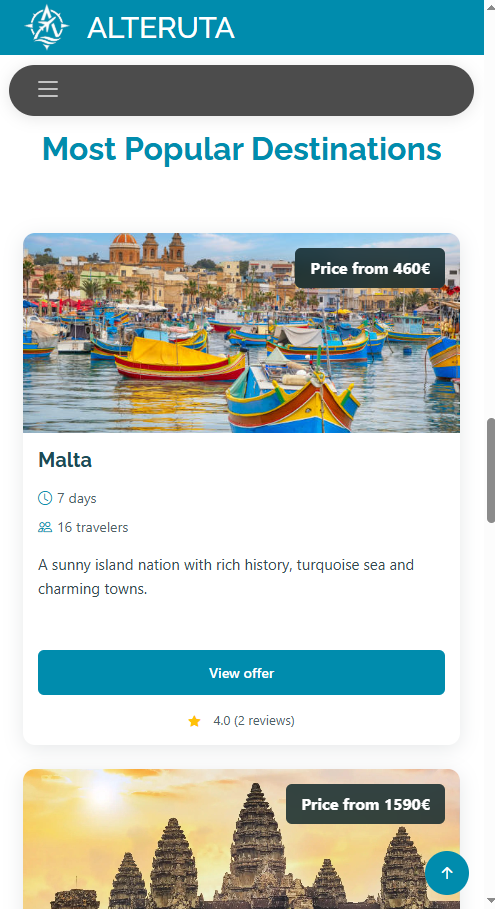
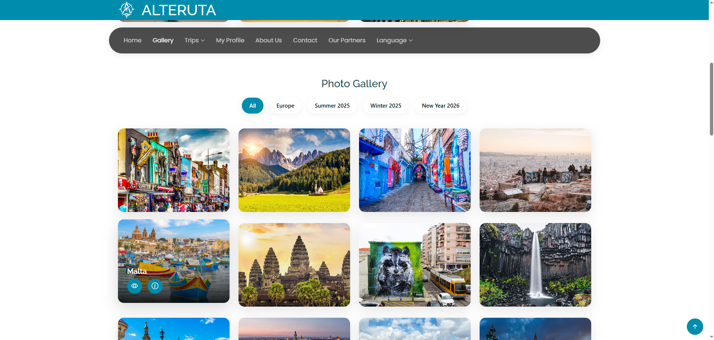
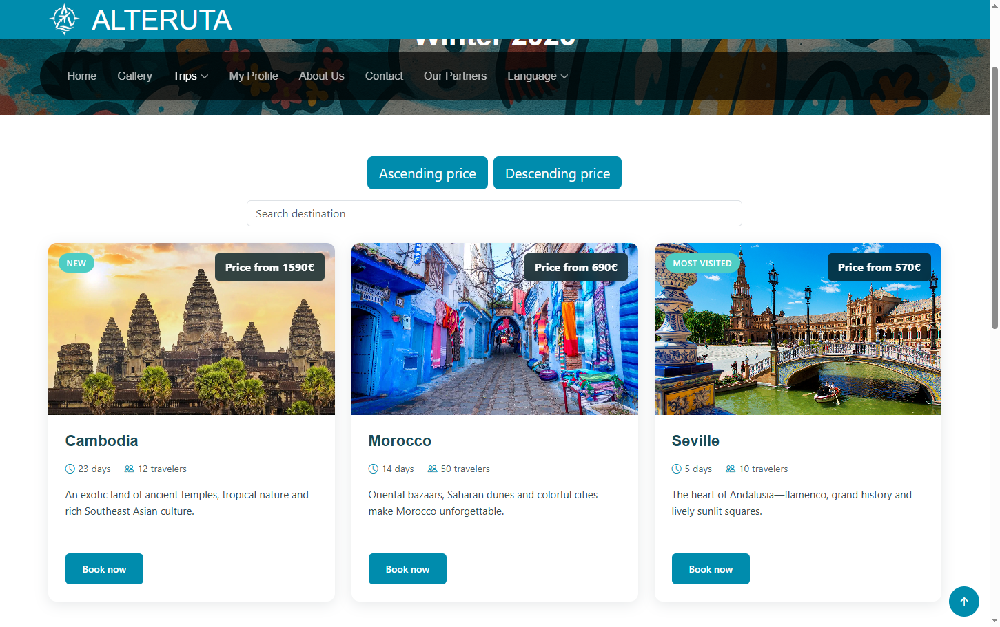
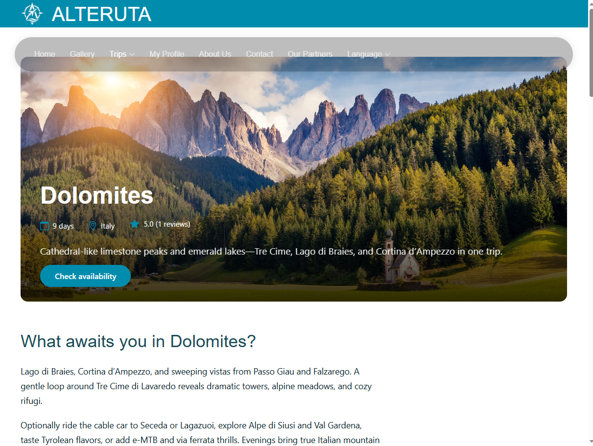
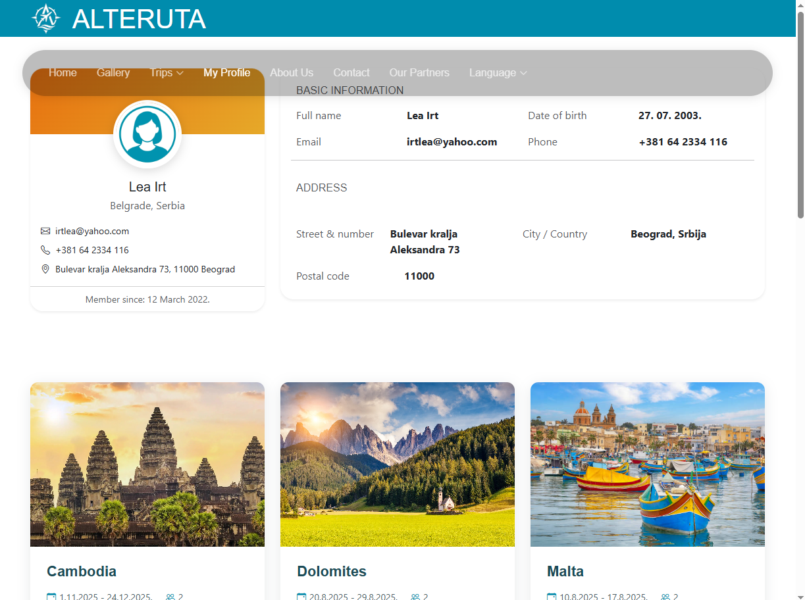

# Alteruta - Travel Agency Website

A modern, responsive travel agency website offering diverse travel packages around the world. The project combines elegant design with functional features for optimal user experience.

## About the Project

Alteruta is a travel agency web platform that allows users to browse different travel packages, photo galleries, destination information, and contact the agency. The website is fully responsive and optimized for all devices.

### Main Pages:
- **Home Page** - Overview of featured packages and promotions
- **Gallery** - Photo gallery of destinations organized by categories
- **Travel Packages** - Detailed view of available travel packages
  - Europe (Barcelona, Lisbon, London, Paris, Krakow)
  - Summer 2025 (Dolomites, Iceland, Malta)
  - Winter 2025 (Cambodia, Morocco, Seville)
  - New Year 2026 (Krakow, Paris)
- **About Us** - Information about the agency
- **Partners** - Collaborators and partners
- **Contact** - Contact form and information
- **My Profile** - User profile management

## Features

- **Responsive Design** - Fully optimized for all devices (desktop, tablet, mobile)
- **Animations** - Smooth scroll animations using AOS library
- **Gallery** - Interactive photo gallery with lightbox effect
- **Filter** - Filtering packages by categories
- **Contact Form** - Validated contact form
- **User Profile** - User profile management system
- **Rating System** - Ability to rate travel packages
- **Navigation** - Intuitive and user-friendly navigation
- **SEO Optimized** - Semantic HTML and optimized structure

## Technologies

### Front-end:
- **HTML5** - Semantic structure
- **CSS3** - Custom styles + Bootstrap 5
- **JavaScript** - Interactivity and dynamic functionalities

### Libraries and Frameworks:
- **Bootstrap 5.x** - Responsive grid system and components
- **AOS (Animate On Scroll)** - Scroll animations
- **GLightbox** - Lightbox gallery
- **Swiper** - Touch slider
- **Isotope Layout** - Filtering and sorting
- **PureCounter** - Animated counters
- **ImagesLoaded** - Image loading helper

### Tools:
- **Bootstrap Icons** - Icon library
- **Google Fonts** - Roboto, Poppins, Raleway fonts

## Screenshots

### Home Page (Mobile Responsive View)

### Gallery

### Travel Packages

### Destination Details

### Profile

## Responsive Design

The website is fully responsive and tested on:
- Mobile devices (320px - 767px)
- Tablets (768px - 1023px)
- Desktop computers (1024px+)

## Design Features

- Modern and clean UI
- Consistent color scheme
- Smooth animations and transitions
- Intuitive navigation
- Optimized images
- Fast loading time

### Notes

- Project developed as part of Web Design course
- Images and content used for educational purposes
- All vendor libraries have their licenses listed in respective folders

